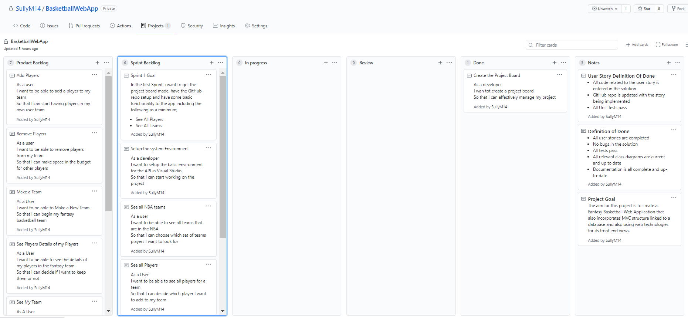
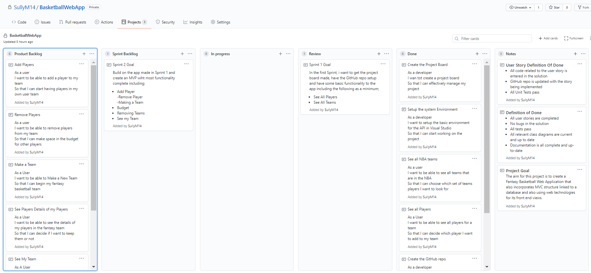
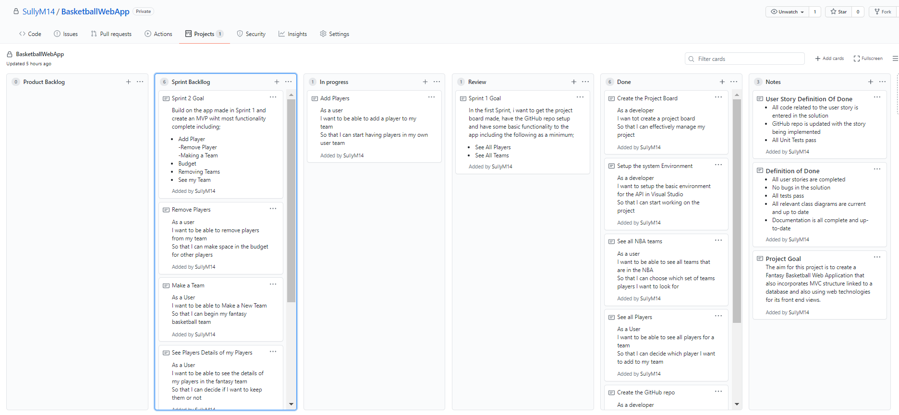
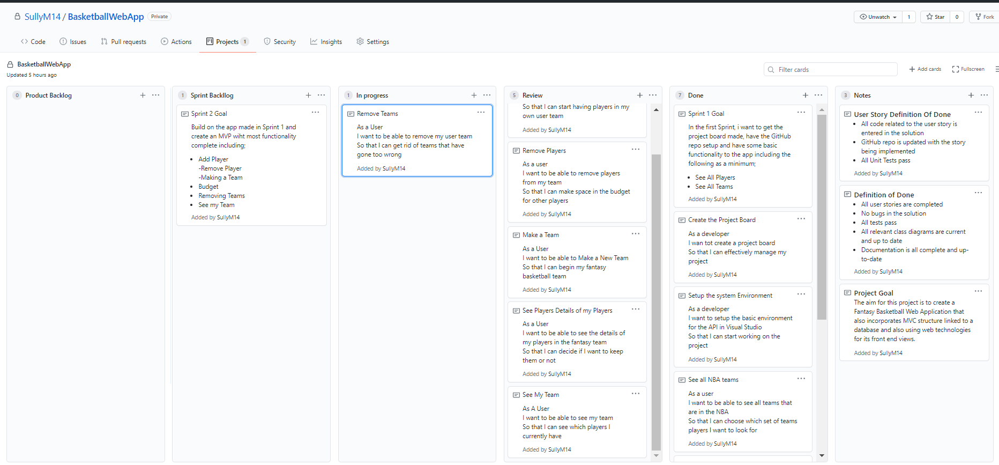
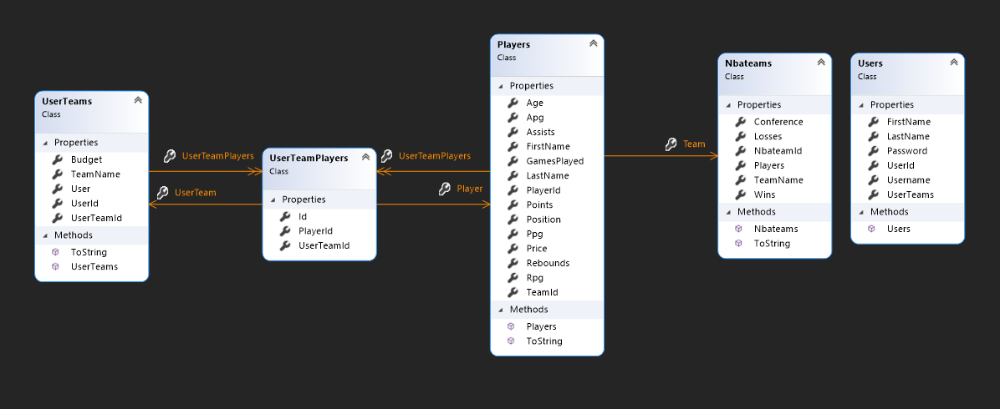
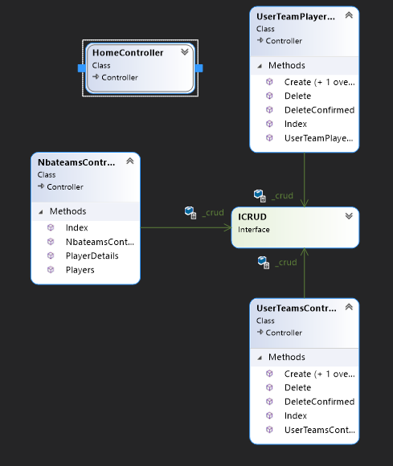
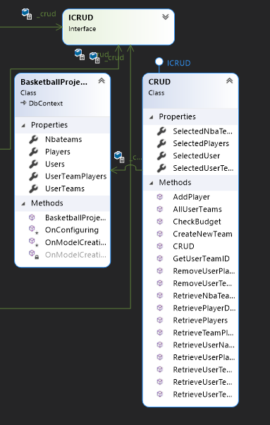

a
# Basketball Web App

## Project Goal

Creating a Web App version of the fantasy basketball application I made previously.

## Definition Of Done

### Project Definition Of Done

- All user stories are completed
- No bugs in the solution
- All tests pass
- All relevant class diagrams are current and up to date
- Documentation is all complete and up-to-date

### User Story Definition of Done

- All code related to the user story is entered in the solution and GitHub is updated (Including Test Code)
- All Unit Tests for the user stories pass

## Sprint 1 Goal

In the first Sprint, I want to get the project board made, have the GitHub repo setup and have some basic functionality to the app including the following as a minimum;

- See All Players
- See All Teams

## Output of Sprint Review

### Beginning of Sprint 1

### Sprint 1 End

## Sprint Retrospective

- ##### Positives

  - Completed the Sprint and met all user stories within the sprints "Definition of done"

- ##### Things I learnt

  - How to begin a project in an MVC structure and scaffold a database

- ##### Action Plan

  - Continue with Sprint 2
  - No user stories unfinished in Sprint 1

## Sprint 2 Goal

Build on the app made in Sprint 1 and create an MVP with most functionality complete including;
- Add Player
- Remove Player
- Making a Team
- Budget
- Removing Teams
- See my Team

## Output of Sprint Review

### Sprint 2 Beginning

### Sprint 2 End

## Sprint Retrospective

- Positives
  - Completed most of the sprint and met all user stories but one
  - Much more confident with using all the different technologies and languages, HTML, CSS and also just more experience with controllers and routing
- Things I learnt
  - Learnt a lot about passing data to views from controllers
  - Learnt more about using HTML, CSS and bootstrap
  - Practicing using the principle of dependency inversion and not having the controller have the logic but an interface which implemented in another class

## Class Diagrams and Main Differences between Old Project and New One

### Models Class Diagram

### Controller Class Diagram

### Services Class Diagram

- The biggest difference is the structure used to make this application. 
- Firstly MVC model was used, which means that there were models, which were the same as the previous project which mapped the tables in the database.
- Next there were Views, these were the front-end and was what was previously written in XAML in a WPF, is now in a .cshtml page and is much more customisable with a lot more options and easier routing options
- Then there was a big change which was having controllers and Services.
- There were 3 controllers that were made, which each had their own purpose
  - UserTeam Controller: In charge of all actions involving creating, deleting and viewing the user's fantasy team
  - UserTeamsPlayers Controller: In charge of all actions involving adding players to a team, removing players from a team and then viewing the players in the user's fantasy team
  - Nbateams Controller: In charge of all actions involved with viewing NBA teams and the players for those teams and their details
- However, these controller didn't have access to the database directly instead they would use services. The services were written with dependency injection in mind, so the controllers created an instance of the interface ICRUD.
- ICRUD was the interface implemented by CRUD which was the class that held all the methods which manipulated and accessed the database. This was done similar to the original project however instead of using the database each time, a version of the context was made that could be used
- This made the code a lot more efficient and easier to understand when being read.

## 
